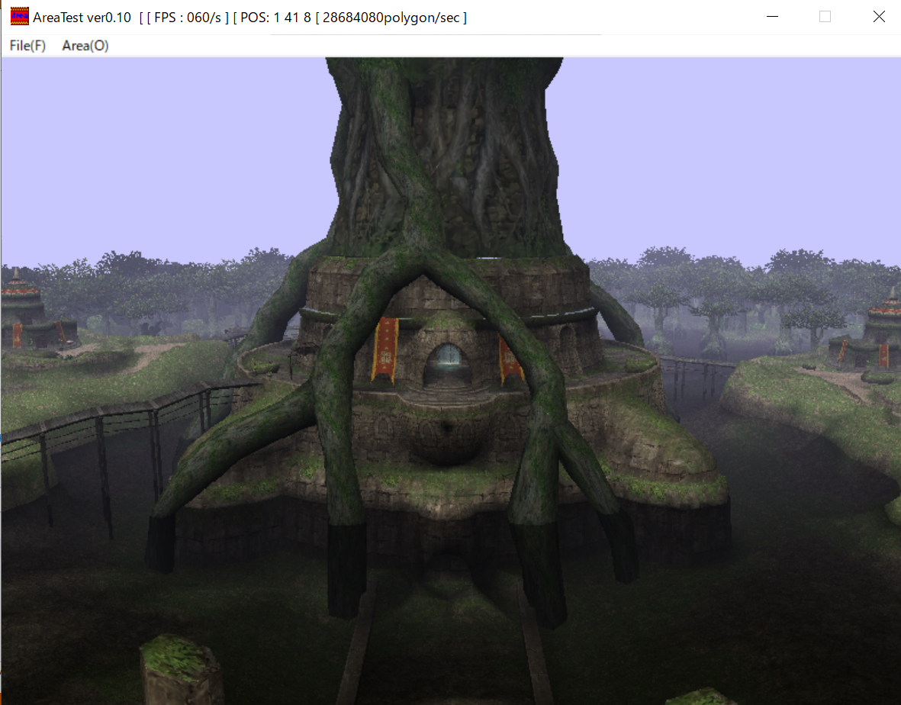
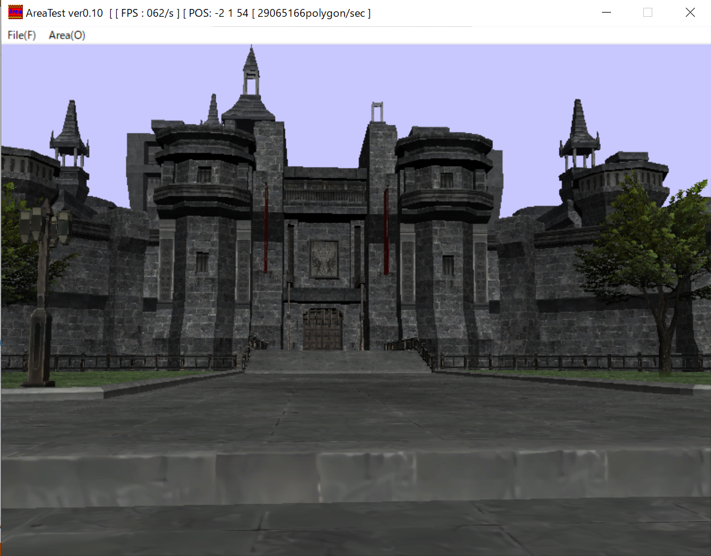
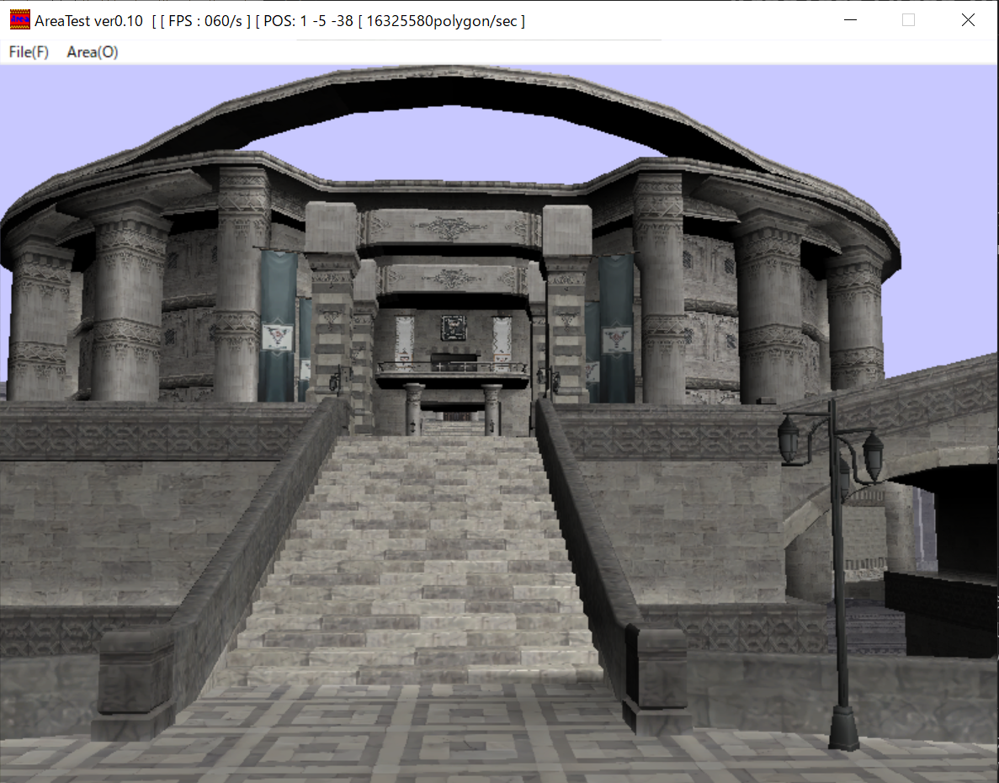
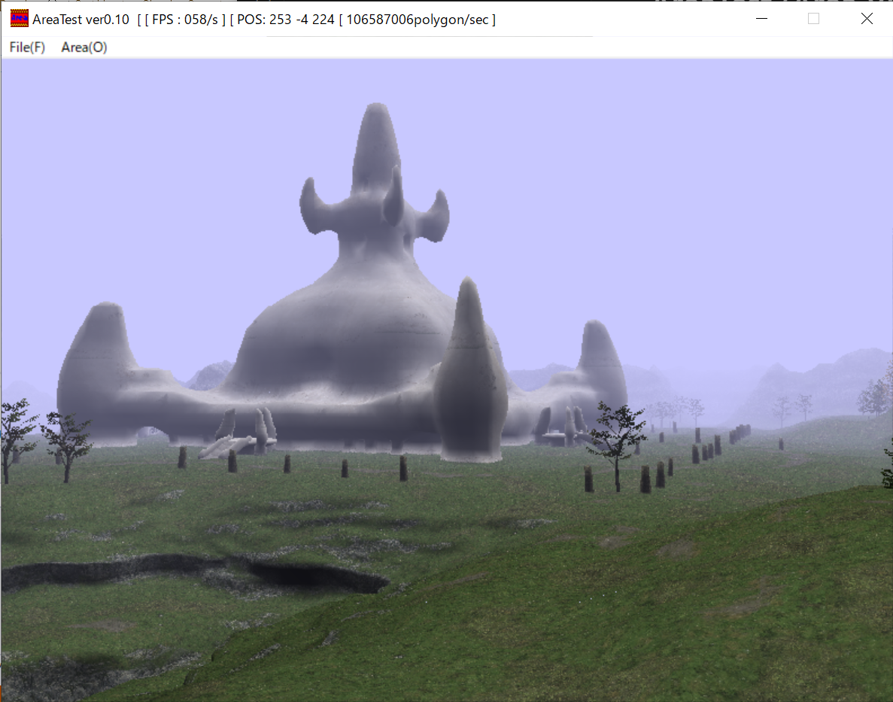
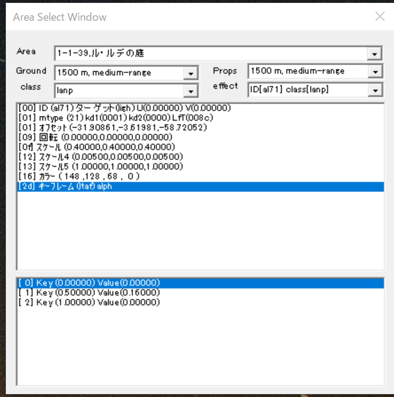

# AreaTest (Area Viewer)

**FFXI (Final Fantasy XI)** のエリアを閲覧・出力するための、DirectX 9ベースのビューアーアプリケーションです。

## 概要

FFXIがインストールされているPCで各エリアを表示するためのツールです。独自のエリアデータを読み込み、3D空間に表示します。Windows APIとDirectX 9をベースに構築されています。

## スクリーンショット (表示例)






## 操作パネル



付属のエリア選択パネルを使用することで、FFXI内の膨大なエリアリストから任意のエリアを選択し、プレビュー表示を切り替えることができます。

## 主な機能

- エリアデータの読み込みと表示
- メタセコイアファイル（MQO）および関連するテクスチャの出力機能
- DirectX 9によるリアルタイムレンダリング
- カメラ操作（視点変更）機能
- 設定ファイルによるパスのカスタマイズ

## 操作方法

| 操作 | アクション |
| :--- | :--- |
| **左ドラッグ** | カメラの回転（視点変更） |
| **右ドラッグ** | カメラの平行移動 |
| **中ドラッグ** | 光源の回転 |
| **マウスホイール** | 前進 / 後退 |

## 設定ファイル (.ini)

プログラムの実行ファイルと同じディレクトリに `.init` ファイルを置くことで、データの参照パスを指定できます。

### 書式
`キー=値` の形式で記述してください。

```ini
MESH_PATH=C:\Games\FFXI
TEX_PATH=Z:\DataFBX\FFXI
```

- **MESH_PATH**: エリアデータ（DATファイル）が格納されているルートディレクトリを指定します。
- **TEX_PATH**: 出力時などに参照するテクスチャファイルのベースディレクトリを指定します。

## 実行用バイナリ

- **exec/**: 実行用バイナリ一式が格納されています。
    - **AreaTest.exe**: アプリケーション本体です。
    - **List/**: エリア選択用のリストファイル（Area.lst 等）が格納されています。

## ファイル構成

- **WinMain.cpp / .h**: アプリケーションのエントリポイント、ウィンドウ生成、メインループ、およびダイアログ制御を記述しています。
- **Area.cpp / .h**: エリア内のメッシュやテクスチャなどの管理を行う中心的なクラスです。
- **Render.cpp / .h**: シーンの描画処理を担当します。
- **Dx.cpp / .h**: DirectX 9 デバイスの初期化やリセット処理をまとめています。
- **hlsl.fx**: 描画に使用されるプログラマブルシェーダー（HLSL）コードです。

## 技術スタック

- **言語**: C++
- **API**: Windows API, DirectX 9 (d3d9, d3dx9)
- **開発環境**: Visual Studio (2013以降推奨)

## 利用規約 (License)

本ソフトウェアは、商用利用および再配布を禁止しています。詳細は [LICENSE](LICENSE) ファイルをご確認ください。

© 2026 yisikawa
